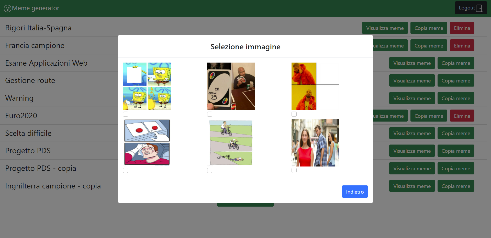
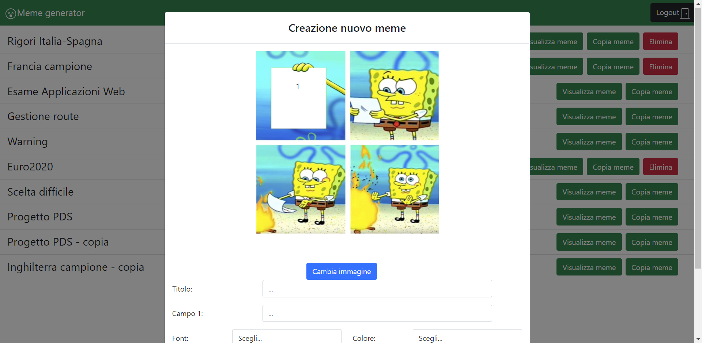

# Exam 2: "Generatore di meme"
## Student: s283340 Stradiotti Luca 

## React Client Application Routes

- Route `/`: pagina principale dell'applicazione da cui un utente non loggato può visualizzare l'elenco dei meme pubblici e un utente loggato può vedere tutti i meme (pubblici e privati). Da questa, nel caso di un utente loggato si può iniziare la creazione di un nuovo meme, la copia di un meme già esistente o eliminare un proprio meme.
- Route `/visualizza_meme/:id`: route per visualizzare le proprietà (titolo, creatore, testo) di un meme identificato da id (parametro della route)

## API Server

### GET `/api/memes`
  - request body: _None_
  - request query parameter: _protected_ serve a far prelevare tutti i meme (pubblici e privati) quando un utente è loggato
  - description: prende la lista dei meme pubblici o tutti i meme presenti in base al parametro protected
  - error responses:  `500 Internal Server Error` (errore generico), `401 Unhautorized` (se non c'è un utente loggato e si cerca di prelevare la lista completa dei meme
  - response: `200 OK` (successo)
  - response body: array di oggetti, ognuno descrive un meme 
``` JSON
[
  {
    "id": 5,
    "iid": 1,
    "title": "Titolo",
    "admin": 2,
    "username": "admin",
    "visibility": "public",
    "fields": 1,
    "color": "red",
    "font": "verdana"
  }, 
  "..."
]
```
  
### GET `/api/memes/:id/sentences`
  - request body: _None_
  - request parameters: id del meme di cui si vuole prelevare il testo
  - description: prende il testo da sovrapporre ad un meme (un oggetto per ogni campo del meme da riempire)
  - response: `200 OK` (successo)
  - error responses:  `500 Internal Server Error` (errore generico)
  - response body: array di oggetti che descrivono il testo (con relativa posizione) da sovrapporre al meme richiesto il meme richiesto (uno o due campi possono essere vuoti)
``` JSON
[
  {"<1 empty item>"},
  { "sentence": "frase", "left": "4.5rem", "bottom": "17.5rem" }
]
```
  
### GET `/api/images`
  - request body: _None_
  - request parameters: _None_
  - description: prende id dell'immagine e relative posizioni del testo offerte dall'applicazione
  - error responses:  `500 Internal Server Error` (errore generico)
  - response: `200 OK` (successo)
  - response body: array di oggetti, ognuno descrive un campo di una specifica immagine offerta
``` JSON
[
  { "id": 5, "field": 1, "left": "5rem", "bottom": "11rem" },
  { "id": 5, "field": 2, "left": "4rem", "bottom": "7rem" },
  "..."
]
```
 
### DELETE `/api/memes/:id`
  - request body: _None_
  - request parameters: id del meme da eliminare
  - description: elimina il meme relativo ad uno specifico id e tutto il testo relativo
  - response: `204 No content` (successo)
  - response body: oggetto vuoto
  - error responses:  `503 Service Unavailable`
### POST `/api/memes/`
  - request body: oggetto che descrive il nuovo meme da inserire
``` JSON
{
  "sentences": [],
  "iid": 4,
  "title": "Rigori Italia-Spagna",
  "visibility": "public",
  "username": "Luca",
  "admin": 1,
  "fields": 3,
  "font": "verdana",
  "color": "black",
  "status": "success"
}
```
  - request parameters: _None_
  - description: inserisce un nuovo meme con relative proprietà (non il resto sovrapposto)
  - response: `200 OK` (successo)
  - response body: id del meme creato
  - error responses:  `503 Service Unavailable`
### POST `/api/sentences/`
  - request body: array di oggetti che descrive i campi di testo relativi ad un nuovo meme già inserito (alcuni oggetti possono non contenere testo)
``` JSON
[
  { "id": 51, "sentence": "Belotti, Bonucci" },
  { "id": 51, "sentence": "Bernardeschi" },
  { "id": 51 }
]
```
  - request parameters: _None_
  - description: inserisce i campi di testo relativi ad un nuovo meme precedentemente inseriti
  - response: `201 Created` (successo)
  - response body: _None_
  - error responses:  `503 Service Unavailable`
### POST `/api/sessions`
  - request body: credenziali dell'utente che vuole loggarsi
``` JSON
{
    "username": "username",
    "password": "password"
}
```
  - description: autentica l'utente che sta provando a loggarsi
  - response: `200 OK` (successo)
  - response body: l'utente autenticato
``` JSON
{
    "id": 1,
    "email": "s283340@studente.polito.it", 
    "username": "Luca"
}
```
  - error responses:  `500 Internal Server Error` (errore generico), `401 Unauthorized User` (login fallito)
### GET `/api/sessions/current`
  - description: controlla se l'utente corrente è autenticato e preleva i suoi dati
  - request body: _None_
  - response: `200 OK` (successo)
  - response body: l'utente autenticato
``` JSON
{
    "id": 1,
    "email": "s283340@studente.polito.it", 
    "username": "Luca"
}
```
  - error responses: `401 Unauthorized User` (l'utente non è loggato)
### DELETE `/api/sessions/current`
  - description: esegue il logout dell'utente corrente
  - request body: _None_
  - response: `200 OK` (successo)
  - response body: _None_
  - error responses:  `500 Internal Server Error` (errore generico), `401 Unauthorized User` (l'utente non è loggato)

## Database Tables

- Tabella `images(iid, field, left, bottom)` - contiene una riga per ogni campo da compilare in un immagine. Il campo iid indica l'id dell'immagine e tramite questo se ne può costruire il nome (date da id+".png). Il campo field indica l'id del campo e di conseguenza può variare da 0 a 2 (ogni immagine avrà in questa tabella 1,2,3 righe in base a quanti campi contiene). Infine i campi left e bottom rappresentano la posizione del testo all'interno dell'immagine.
- Tabella `memes(mid, title, visibility, admin, iid, font, color)` - contiene una riga per ogni meme con tutti i suoi attributi. mid rappresenta l'id del meme, title il titolo, visibility  la visibilitità. Admin è l'id dell'utente ad aver creato il meme, mentre iid rappresenta l'id dell'immagine utilizzata. Font e color descrivono il font ed il colore usati dal meme.
- Tabella `sentences(sid,id,sentence)` - contiene una riga per ogni campo di testo specificato per un dato meme. sid rappresenta l'id del campo, id rappresenta l'id del meme e sentence rappresenta il contenuto del campo testuale.
- Tabella `users (id, username, email, password)` - contiene una riga per ogni admin autorizzato a creare meme e visualizzare tutti i meme compresi quelli privati (il campo password viene salvato criptato per ragioni di sicurezza).

## Main React Components

- `MyPage` (in `MyPage.js`): pagina principale in cui son contenute le route dell'applicazione e le varie funzioni per eliminare e aggiungere meme alla lista.
- `MyNavbar` (in `MyNavbar.js`): rappresenta la navbar dell'applicazione e contiene i pulsanti per effettuare login e logout.
- `MemeList` (in `MemeList.js`): il componente che renderizza la lista di meme disponibili a visualizzatori/creatori che possono essere visualizzati tramite l'apposito bottone 'Visualizza meme'. Contiene anche, nel caso in cui ci sia un utente loggato, i pulsanti per copiare ed eliminare un meme. Nel caso di utente loggato permette di distinguere tra meme pubblici e protetti tramite apposita icona (presente nelle righe dei meme protetti).
- `VisualizzaMeme` (in `VisualizzaMeme.js`): permette di visualizzare un meme con le relative proprietà, cioè le frasi sovrapposte al meme più informazioni relative a titolo e nome del suo creatore.
- `ModalCreateMeme` (in `MyModals.js`): modale che viene utilizzato per la creazione di un nuovo meme. Permette inizialmente di selezionare l'immagine da usare come base e successivamente di inserire le proprietà relative al meme (titolo, visibilità, testo, font, colore).
- `ModalCopyMeme` (in `MyModals.js`): modale utilizzato per la copia di un meme già esistente. Inizialmente i campi relativi alle proprietà del meme sono preimpostati con i valori del meme da copiare.
- `ModalLogin` (in `MyModals.js`): modale che permette ad un creatore di effettuare il login.

## Screenshot




## Users Credentials

( dopo i due punti sono elencati i meme creati da quell'utente)

- s283340@studente.polito.it, studente : Rigori Italia-Spagna, Francia campione, Euro2020)
- admin@gmail.com, password : Esame Applicazioni Web, Gestione route, Warning)
- student@polito.it, password : Scelta difficile, Progetto PDS, Progetto PDS - copia (tramite copia di Progetto PDS), Inghilterra campione - copia (tramite copia di Francia campione)
